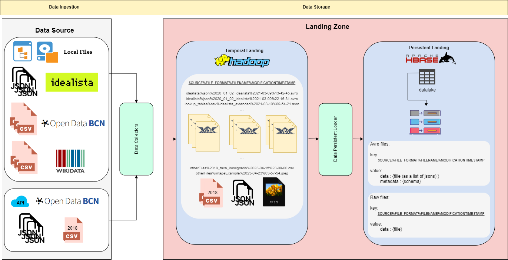

# Landing Zone

<p align="center"></p>
<p align="center"><em>Pipeline diagram we implemented</em></p>

## Temporal landing zone
The pipeline our data follows when is added into the temporal landing zone is the following one:

Data Collectors:

1. We manually download the Idealista, OpenData BCN and lookup files into our local machine. You can find all the files in [data](data) folder.
In this case, we assume saving them locally is not a problem due to the small number of files.


2. We automatically collect data about immigration from the API of OpenData BCN. This data comes from 
[here](https://opendata-ajuntament.barcelona.cat/data/es/dataset/est-demo-taxa-immigracio/).

   * For each year we have a different API request, so we automatically scrap all available URLs and get all JSON files 
   for the different available years.

   * As a special case, data from 2018 is not available to get from the API, so we download it manually in a CSV file 
   (i.e., [2018_taxa_immigracio.csv](data%2FotherFiles%2F2018_taxa_immigracio.csv)).


3. We have defined an avro schema for each data topology we had in [resources](resources) folder: one for Idealista 
property JSON files (i.e., [idealista.avsc](resources%2Fidealista.avsc)), one for lookup CSV files 
(i.e., [lookup_tables.avsc](resources%2Flookup_tables.avsc)), another for OpenData Income CSV files 
(i.e., [opendatabcn-income.avsc](resources%2Fopendatabcn-income.avsc)) and another for the OpenData Immigration JSON 
files from the API (i.e., [opendatabcn-immigration.avsc](resources%2Fopendatabcn-immigration.avsc)).

    **_NOTE_**: we did not define a schema for the special 2018 case in the API data collection. 


4. Each raw file (i.e., those in [data](data)) is read and transformed into avro format, if possible (i.e., if it exists 
a predefined schema for them).
   * In case we want to include other files with no schema or unknown schema (e.g., images, files from other sources, files 
   with other formats, special 2018 case, etc.), we load them rawly in our temporal landing Zone. We do not convert files
   to Avro format for which we don't have a predefined schema.

   **_NOTE_**: We decided to convert files to avro format because we assume we could have much more data, so we wanted to 
   compress our files a bit and make them easier to distribute by taking advantage of its horizontal fragmentation. As 
we wanted to use the whole files, we chose Avro instead of Parquet, so in this case it is a better choice in terms of 
performance. Even this conversion has a cost in insertion (i.e., checking the file matches the schema and validating the
presence and the domains of the data) and a cost in preparing the data (i.e., predefining the schemas of the files) 
having the schema of the files could benefit query time by saving an explicit casting and type conversion in future 
analytical steps.


5. Files are sent to HDFS with a given name. HDFS host and port can be found in [config.cfg](src%2Futils%2Fconfig.cfg).
We give a name to the different files in order to recognize where they come
from (e.g., idealista), its original data format (e.g., CSV), its original filename (e.g., 2020_01_02_idealista) and be
able to save different versions of the files by adding their modification timestamp (e.g., 2021-03-09 13:42:45).
   * The names of the local files are given in the following format:
     * In case they are converted to avro format: `source%rawFileFormat%orginalFilename%modificationDate%modifcationTime.avro`
     
         **_NOTE_**: We add the `.avro` extension to identify Avro files and add the original file type inside the filename.
       `source` name is given by the folder where files come from (e.g., [idealista](data%2Fidealista), [lookup_tables](data%2Flookup_tables),
     [opendatabcn-income](data%2Fopendatabcn-income), etc.)

     * In case they are loaded as raw files: `source%orginalFilename%modificationDate%modifcationTime.fileFormat`
     
       **_NOTE_**: We keep the original file extension to identify the formats of the flies at the end of the filename 
     and not inside.

      * In case they are loaded directly from the API:
         * If converted to avro: `source%json%originalFilename.avro`
         * If not converted to avro format: `source%originalFilename.json`
        
         **_NOTE_**: It follows the same structure as the previous cases but we do not include the modification timestamp.
     We should save the files locally to get the modification time so we decide to not include it. This is not a problem 
     since those files are only uploaded on the OpenData BCN repository once a year. Also the original filenames are 
     extracted while scrapping the OpenData BCN website.


6. Each time you run the code, only new data is loaded into HDFS.
   * If a file has not been modified from the last data load, it will not be overwritten in HDFS. This is the reason we 
   added a modification timestamp to the filenames, so every time a file is updated it can be sent to HDFS. Otherwise,
   the modification timestamp will not change and the file will not be included in the temporal Landing Zone because 
   the file already exists in there. This has the same utility as it would have a logs file to check the files that 
   should be included or not and allow us to have different versions of a file in our distributed file system. In this 
   case, taking into account the smallest time granularity is the second, if the same file is modified at the same time 
   (i.e., at the same second) in different servers, only the first version to be loaded in HDFS will be kept.

## Persistent Landing Zone
AQUI LO TUYO BRO <3

# How to run the code
To load both the temporal and persistent landing zones with the data, you just need to run [run.sh](run.sh). 
Simply running it, the full pipeline is implemented. 
This script basically runs [temporalLanding.py](temporalLanding.py) which is in charge of loading the temporal landing zone given some arguments in the console, and 
[persistentLanding.py](persistentLanding.py), which loads data in the persistent landing zone. 
The script tries to upload preferable Avro files in HDFS. In case it is not possible due to any reason (mainly because of a lack of a predefined schema), it loads the files in raw format.
    
**_NOTE:_** If you need to install some modules you can run the `pip install -r requirements.txt` command on top of [run.sh](run.sh) script. 
If you do not want to load Avro files but only the raw data, you can uncomment `UPLOAD RAW FILES TO HDFS` section in [run.sh](run.sh) and comment the `CREATE AND UPLOAD AVRO FILES` section.

Here we show some instructions on how to run the different files in case it is preferred to run it in a different way.
## How to run [temporalLanding.py](temporalLanding.py)
We have different options to load the data in HDFS. Before using them, remember to set properly the environment variables as in [run.sh](run.sh):
```{bash}
export PROJECT_DIRECTORY="$PWD"
export HDFS_DIRECTORY="/user/bdm/Temporal_LZ/"
```
### Options to load Avro format files (if possible)
1. Load all data in HDFS. This option loads all local files in [data](data) and loads the data collected from the
[OpenData BCN API](https://opendata-ajuntament.barcelona.cat/data/es/dataset/est-demo-taxa-immigracio/). 
If the files have a predefined schema in [resources](resources), they will be loaded in Avro format. 
Otherwise, they will be loaded in raw format. For example, when we want to load other files we could have from 
[otherFiles](data%2FotherFiles) folder such as the previously mentioned [special 2018 case](data%2FotherFiles%2F2018_taxa_immigracio.csv) 
from the API, those files will be uploaded with no conversion. In our case we have the 2018 immigration `.csv` file from OpenData BCN API and a `.jpeg` image of some house in Barcelona.

   **_NOTE:_** Schema file names need to be the same as the data folder where files are contained. Otherwise, schemas will not be assigned to the data.
If we need to add new data from the same source but with a different schema, we will need to create a new folder with a new name (same as it would have the new schema) to save the new data.

```{bash}
python temporalLanding.py write avro
```
2. Load specific local files. If you want to load only specific local data folders, you can do it by specifying the name of the folder your files are contained in.
Same logic as in previous option is applied here.
```{bash}
python temporalLanding.py write avro -i idealista
```
```{bash}
python temporalLanding.py write avro -i lookup_tables
```
```{bash}
python temporalLanding.py write avro -i opendatabcn-income
```
```{bash}
python temporalLanding.py write avro -i otherFiles
```
3. Load only data from the [API](https://opendata-ajuntament.barcelona.cat/data/es/dataset/est-demo-taxa-immigracio/). Same logic is applied here.
```{bash}
python temporalLanding.py write avro -i opendatabcn-immigration
```
### Options to load raw format files
1. Load all data in HDFS. This option loads all local files in [data](data) and loads the data collected from the
[OpenData BCN API](https://opendata-ajuntament.barcelona.cat/data/es/dataset/est-demo-taxa-immigracio/).
Using this option, files are loaded in raw format (e.g., CSV, JSON, etc.)

```{bash}
python temporalLanding.py write raw
```
2. Load specific local files. If you want to load only specific local data folders, you can do it by specifying the name of the folder your files are contained in.
```{bash}
python temporalLanding.py write raw -i idealista
```
```{bash}
python temporalLanding.py write raw -i lookup_tables
```
```{bash}
python temporalLanding.py write raw -i opendatabcn-income
```
```{bash}
python temporalLanding.py write raw -i otherFiles
```
3. Load only data from the [API](https://opendata-ajuntament.barcelona.cat/data/es/dataset/est-demo-taxa-immigracio/). 
```{bash}
python temporalLanding.py write raw -i opendatabcn-immigration
```
**_NOTE_**: Files from [reader](src%2Freader) are not used in our pipeline, they are simply readers for Avro and Parquet files (in case you have them saved locally) that have been useful to work with.
They can be used as:
```{bash}
python temporalLanding.py read avro -r <localAvroFilePath>
```
```{bash}
python temporalLanding.py read parquet -r <localParquetFilePath>
```
## How to run [persistentLanding.py](persistentLanding.py)
NO SE SI TENDRAS ALGO PARA PONER AQUI, SINO PON ALGO SIMLPE QUE SE EJECUTA POR SI SOLO.


